# ZHFMBlog
珠海市美食博客管理系统

#### 技术介绍
客户端Vue3，服务端Nest，数据库MongoDB，组件库Antd

#### 安装教程

1.  yarn add
2.  cd web/admin
3.  yarn serve
4.  前台接口文档http://localhost:5000/api-docs
    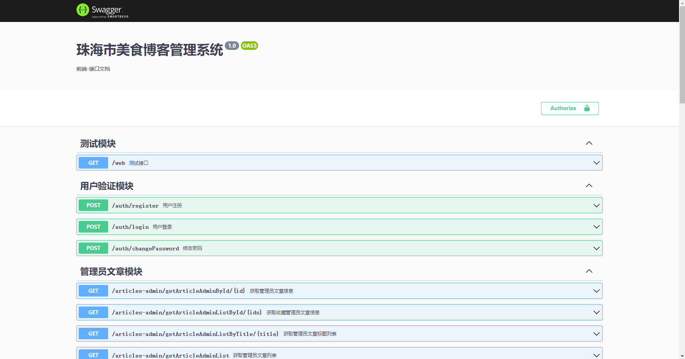

5.  后台接口文档http://localhost:4000/api-docs
    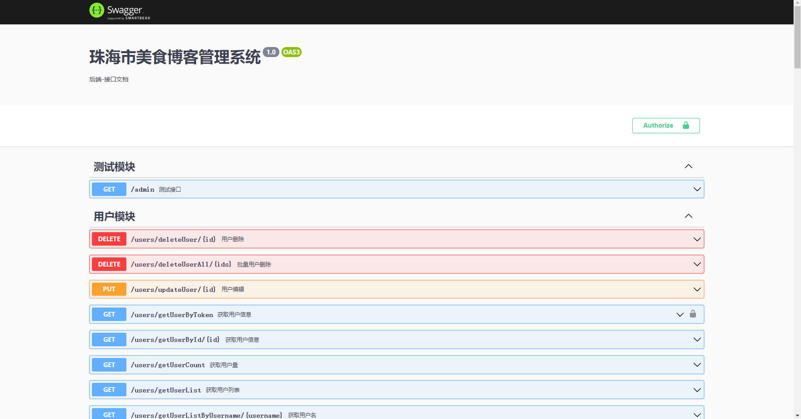

#### 使用说明

1.  管理员用户名：admin，管理员密码：123456
2.  服务端地址：[https://gitee.com/JudgeFF/zhfmblog-server](https://github.com/JudgeFFF/ZHFMBlog-server.git)

#### 参与贡献

1.  担任项目的开发，负责整体技术设计和开发工作，推动项目正常上线

#### 相关截图

前台短视频介绍城市

前台管理员文章
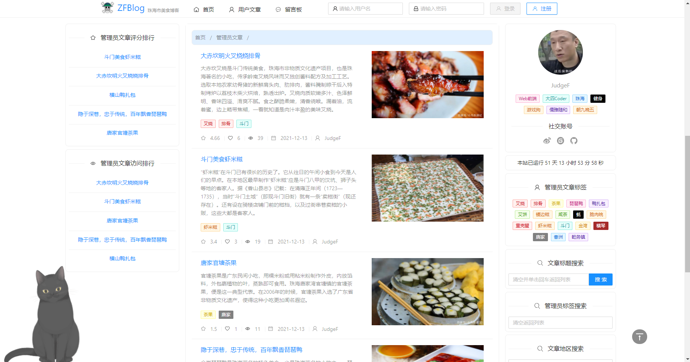

前台用户文章
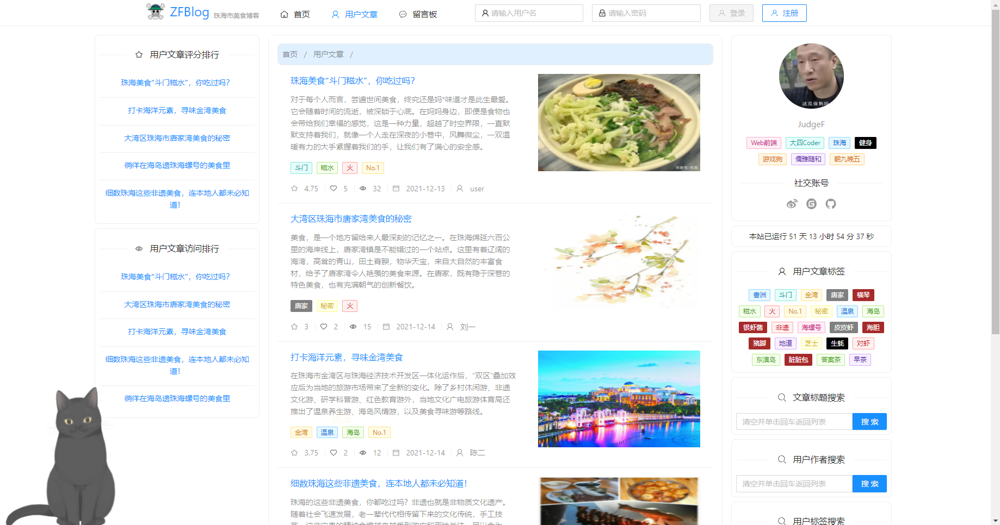

前台留言板
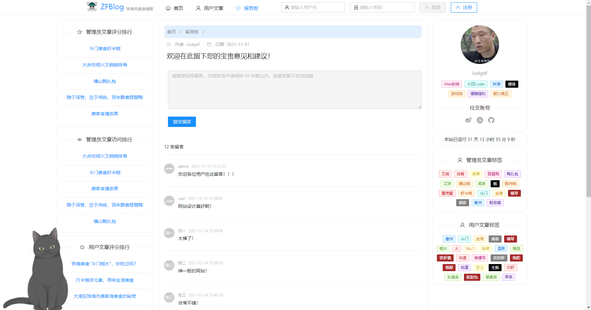

前台收藏文章
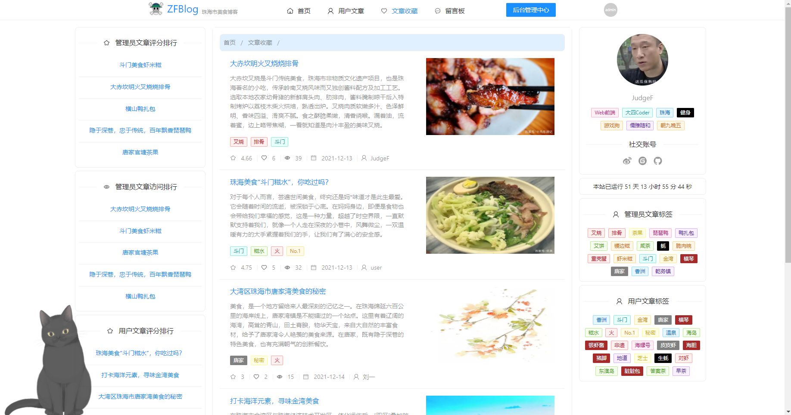

前台文章详情
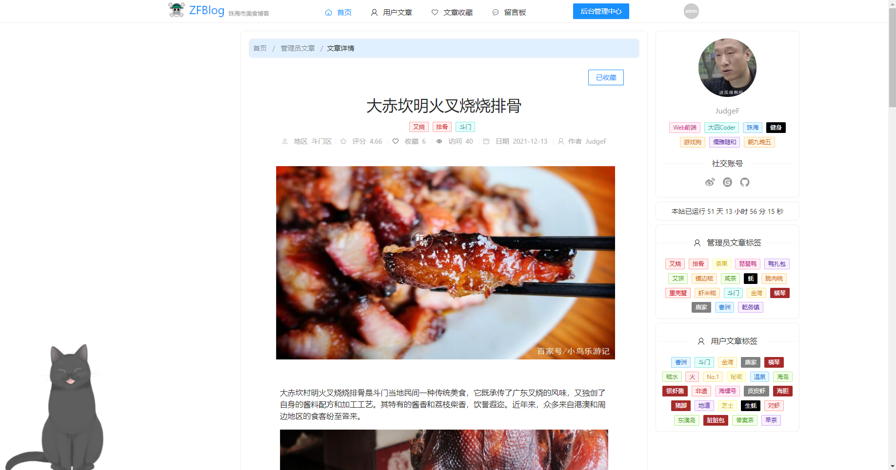

管理员后台管理中心
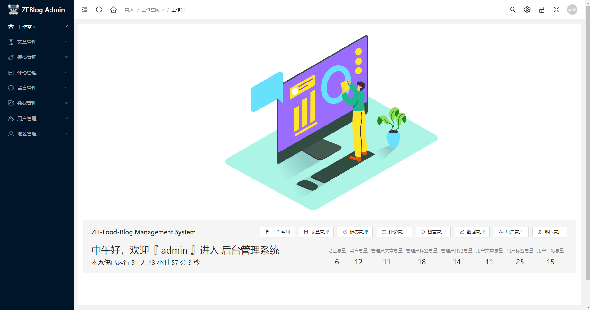

普通用户文章创作中心
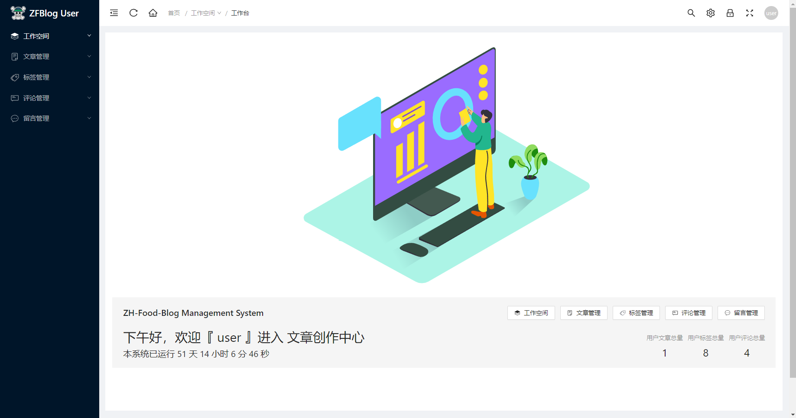

后台文章列表
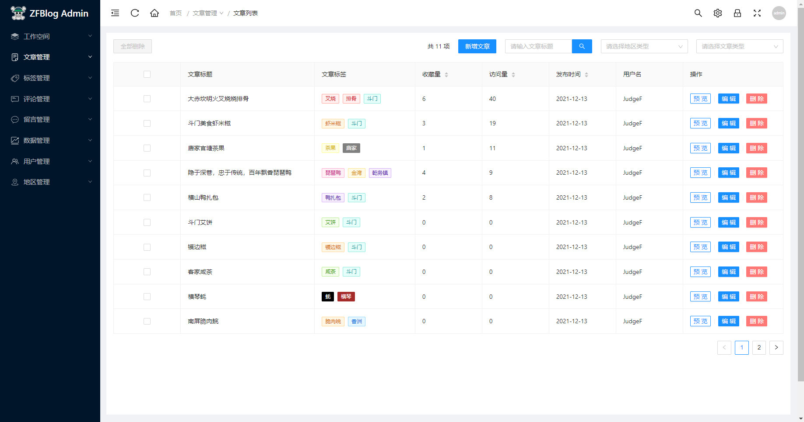

后台文章编辑
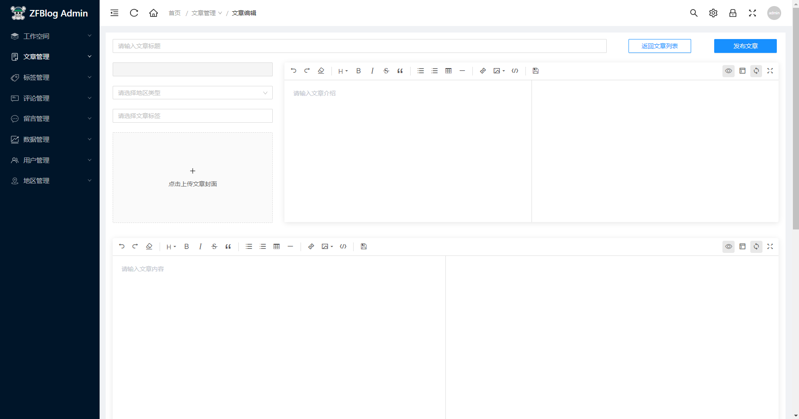
